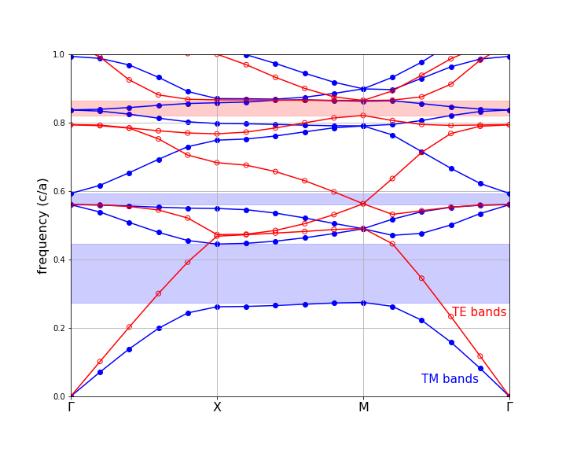
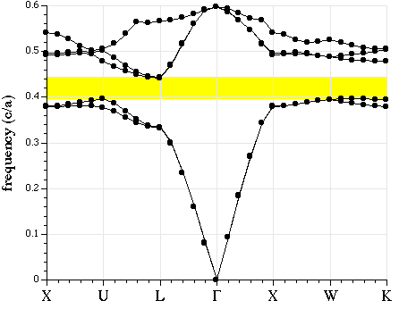
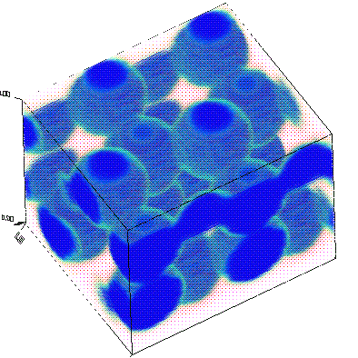
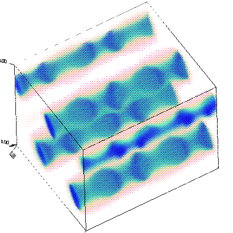
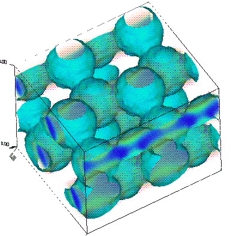
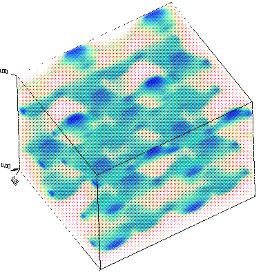
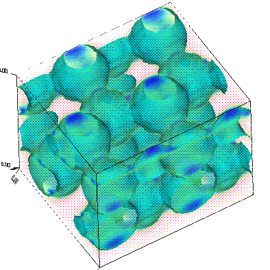

---
Data Analysis Tutorial
---

In the [Tutorial](Scheme_Tutorial.md), we focused on how to perform a calculation. Now, we'll provide a brief description on what you might do with the results of the calculations, and in particular how you might visualize the results. We'll focus on two systems: 2d and 3d.

[TOC]

Triangular Lattice of Rods
--------------------------

First, we'll return to the two-dimensional [triangular lattice of rods](Scheme_Tutorial.md#bands-of-a-triangular-lattice) in air.  See also [our online textbook](http://ab-initio.mit.edu/book), ch. 5. The control file for this calculation, which can also be found in `mpb/examples/tri-rods.ctl`, will consist of:

### The tri-rods.ctl Control File

```
(set! num-bands 8)
(set! geometry-lattice (make lattice (size 1 1 no-size)
                         (basis1 (/ (sqrt 3) 2) 0.5)
                         (basis2 (/ (sqrt 3) 2) -0.5)))
(set! geometry (list (make cylinder
                       (center 0 0 0) (radius 0.2) (height infinity)
                       (material (make dielectric (epsilon 12))))))
(set! k-points (list (vector3 0 0 0)          ; Gamma
                     (vector3 0 0.5 0)        ; M
                     (vector3 (/ -3) (/ 3) 0) ; K
                     (vector3 0 0 0)))        ; Gamma
(set! k-points (interpolate 4 k-points))
(set! resolution 32)
(run-tm (output-at-kpoint (vector3 (/ -3) (/ 3) 0)
                          fix-efield-phase output-efield-z))
(run-te)
```

The `geometry-lattice` input defines the *primitive lattice vectors* `basis1` and `basis2` of the [periodic lattice](https://en.wikipedia.org/wiki/Bravais_lattice), here for a [triangular ("hexagonal") lattice](https://en.wikipedia.org/wiki/Hexagonal_lattice), which determines the periodicity of the structure ε(**x**).  This choice of basis vectors, in turn, determines a [reciprocal lattice](https://en.wikipedia.org/wiki/Reciprocal_lattice) in which the Bloch wavevector **k** is periodic.  The `k-points` input variable specifies the **k** vectors for which we compute the band structure ω(**k**) in the *basis of the reciprocal-lattice vectors*.  In this tutorial, we choose the `k-points` along the edges of the [irreducible Brillouin zone](https://en.wikipedia.org/wiki/Brillouin_zone), whose corners are conventionally called Γ, M, and K for this lattice.  The diagram below shows the lattice and reciprocal lattice, our choice of basis vectors, the corresponding reciprocal-lattice basis vectors, and this irreducible Brillouin zone.

<center></center>

Our [online textbook](http://ab-initio.mit.edu/book) has more information on lattices and Brillouin zones in Appendix B.  Note, however, that for a given lattice there are multiple choices of basis vectors and irreducible Brillouin zones that are equivalent according to the symmetry of the lattice, and the book uses a slightly different choice for the triangular lattice.

Notice that we're computing both TM and TE bands where we expect a gap in the TM bands, and are outputting the z component of the electric field for the TM bands at the K point. The `fix-efield-phase` will be explained below.

Now, run the calculation, directing the output to a file, by entering the following command at the Unix prompt:

```
unix% mpb tri-rods.ctl >& tri-rods.out
```

It should finish in a few seconds.

### The tri-rods Dielectric Function

In most cases, the first thing we'll want to do is to look at the dielectric function, to make sure that we specified the correct geometry. We can do this by looking at the `epsilon.h5` output file.

The first thing that might come to mind would be to examine `epsilon.h5` directly, say by converting it to a PNG image with `h5topng` from [h5utils](https://github.com/NanoComp/h5utils), magnifying it by 3:

```
unix% h5topng -S 3 epsilon.h5
```

<center></center>

This image initially seems wrong! Why is the rod oval-shaped and not circular? Actually, the dielectric function is correct, but the image is distorted because the primitive cell of our lattice is a rhombus with 60<sup>$\circ$</sup> acute angles. Since the output grid of MPB is defined over the non-orthogonal unit cell, while the image produced by `h5topng` and most other plotting programs is square, the image is skewed.

We can fix the image in a variety of ways, but the best way is probably to use the `mpb-data` utility included and installed with MPB. `mpb-data` allows us to rearrange the data into a rectangular cell (`-r`) with the same area/volume, expand the data to include multiple periods (`-m` *`periods`*), and change the resolution per unit distance in each direction to a fixed value (`-n` *`resolution`*). `man` `mpb-data` or run `mpb-data` `-h` for more options. In this case, we'll rectify the cell, expand it to three periods in each direction, and fix the resolution to 32 pixels per *a*:

```
unix% mpb-data -r -m 3 -n 32 epsilon.h5
```

It's important to use `-n` when you use `-r`, as otherwise the non-square unit cell output by `-r` will have a different density of grid points in each direction, and appear distorted. The output of `mpb-data` is by default an additional dataset within the input file, as we can see by running `h5ls`:

```
unix% h5ls epsilon.h5 
data                     Dataset {32, 32}
data-new                 Dataset {96, 83}
description              Dataset {SCALAR}
lattice\ copies          Dataset {3}
lattice\ vectors         Dataset {3, 3}
```

<center></center>

Here the new dataset output by `mpb-data` is the one called `data-new`. We can examine it by running `h5topng` again, this time explicitly specifying the name of the dataset (and no longer magnifying):

```
unix% h5topng epsilon.h5:data-new
```

The new `epsilon.png` output image is shown at right. As you can see, the rods are now circular as desired, and they clearly form a triangular lattice.

### Gaps and Band Diagram for tri-rods

At this point, let's check for band gaps by picking out lines with the word "Gap" in them:

```
unix% grep Gap tri-rods.out
Gap from band 1 (0.275065617068082) to band 2 (0.446289918847647), 47.4729292989213%
Gap from band 3 (0.563582903703468) to band 4 (0.593059066215511), 5.0968516236891%
Gap from band 4 (0.791161222813268) to band 5 (0.792042731370125), 0.111357548663006%
Gap from band 5 (0.838730315053238) to band 6 (0.840305955160638), 0.187683867865441%
Gap from band 6 (0.869285340346465) to band 7 (0.873496724070656), 0.483294361375001%
Gap from band 4 (0.821658212109559) to band 5 (0.864454087942874), 5.07627823271133%
```

The first five gaps are for the TM bands (which we ran first), and the last gap is for the TE bands. Note, however that the &lt; 1% gaps are probably false positives due to band crossings, as described in the [tutorial](Scheme_Tutorial.md#our-first-band-structure). There are no complete (overlapping TE/TM) gaps, and the largest gap is the 47% TM gap as expected. See [our online textbook](http://ab-initio.mit.edu/book), appendix C. To be absolutely sure of this and other band gaps, we would also check k-points within the interior of the Brillouin zone, but we'll omit that step here.

Next, let's plot out the band structure. To do this, we'll first extract the TM and TE bands as comma-delimited text, which can then be imported and plotted in our favorite spreadsheet/plotting program.

```
unix% grep tmfreqs tri-rods.out > tri-rods.tm.dat
unix% grep tefreqs tri-rods.out > tri-rods.te.dat
```

The TM and TE bands are both plotted below against the "k index" column of the data, with the special k-points labelled. TM bands are shown in blue (filled circles) with the gaps shaded light blue, while TE bands are shown in red (hollow circles) with the gaps shaded light red.

<center></center>

Note that we truncated the upper frequencies at a cutoff of 1.0 c/a. Although some of our bands go above that frequency, we didn't compute enough bands to fill in all of the states in that range. Besides, we only really care about the states around the gap(s), in most cases.

### The Source of the TM Gap: Examining the Modes

Now, let's actually examine the electric-field distributions for some of the bands which were saved at the K point, remember. Besides looking neat, the field patterns will tell us about the characters of the modes and provide some hints regarding the origin of the band gap.

As before, we'll run `mpb-data` on the field output files (named `e.k11.b*.z.tm.h5`), and then run `h5topng` to view the results:

```
unix% mpb-data -r -m 3 -n 32 e.k11.b*.z.tm.h5
unix% h5topng -C epsilon.h5:data-new -c bluered -Z -d z.r-new e.k11.b*.z.tm.h5
```

Here, we've used the `-C` option to superimpose black contours of the dielectric function over the fields, `-c` `bluered` to use a blue-white-red color table, `-Z` to center the color scale at zero (white), and `-d` to specify the dataset name for all of the files at once. `man h5topng` for more information. There are plenty of data-visualization programs available if you want more sophisticated plotting capabilities than what `h5topng` offers, of course; you can use `h5totxt` to convert the data to a format suitable for import into e.g. spreadsheets.

Note that the dataset name is `z.r-new`, which is the real part of the z component of the output of `mpb-data`. Since these are TM fields, the z component is the only non-zero part of the electric field. The real and imaginary parts of the fields correspond to what the fields look like at half-period intervals in time, and in general they are different. However, at K they are redundant, due to the inversion symmetry of that k-point (proof left as an exercise for the reader). Usually, looking at the real parts alone gives you a pretty good picture of the state, especially if you use `fix-efield-phase` (see below), which chooses the phase to maximize the field energy in the real part. Sometimes, though, you have to be careful: if the real part happens to be zero, what you'll see is essentially numerical noise and you should switch to the imaginary part.

The resulting field images are shown below:

| TM band 1                                                    | TM band 2                                                    | TM band 3                                                    | TM band 4                                                    | TM band 5                                                    | TM band 6                                                    | TM band 7                                                    | TM band 8                                                    |
|--------------------------------------------------------------|--------------------------------------------------------------|--------------------------------------------------------------|--------------------------------------------------------------|--------------------------------------------------------------|--------------------------------------------------------------|--------------------------------------------------------------|--------------------------------------------------------------|
|  |  |  |  |  |  |  |  |

Your images should look the same as the ones above. If we hadn't included `fix-efield-phase` before `output-efield-z` in the ctl file, on the other hand, yours would have differed slightly (e.g. by a sign or a lattice shift), because by default the phase is *random*.

When we look at the real parts of the fields, we are really looking at the fields of the modes at a particular instant in time and the imaginary part is half a period later. The point in time relative to the periodic oscillation of the state is determined by the phase of the eigenstate. The `fix-efield-phase` band function picks a canonical phase for the eigenstate, giving us a deterministic picture.

We can see several things from these plots:

First, the origin of the band gap is apparent. The lowest band is concentrated within the dielectric rods in order to minimize its frequency. The next bands, in order to be orthogonal, are forced to have a node within the rods, imposing a large "kinetic energy" (and/or "potential energy") cost and hence a gap. See [our online textbook](http://ab-initio.mit.edu/book), ch. 5. Successive bands have more and more complex nodal structures in order to maintain orthogonality. The contrasting absence of a large TE gap has to do with boundary conditions. The perpendicular component of the displacement field must be continuous across the dielectric boundary, but the parallel component need not be.

We can also see the deep impact of symmetry on the states. The K point has C<sub>3v</sub> symmetry and not quite the full C<sub>6v</sub> symmetry of the dielectric structure. This symmetry group has only one two-dimensional representation--that is what gives rise to the degenerate pairs of states (2/3, 4/5, and 7/8), all of which fall into this "p-like" category where the states transform like two orthogonal dipole field patterns, essentially. The other two bands, 1 and 6, transform under the trivial "s-like" representation with band 6 just a higher-order version of 1.

Diamond Lattice of Spheres
--------------------------

Now, let us turn to a three-dimensional structure, a diamond lattice of dielectric spheres in air. See [our online textbook](http://ab-initio.mit.edu/book), ch. 6. The basic techniques to compute and analyze the modes of this structure are the same as in two dimensions, but of course, everything becomes more complicated in 3d. It's harder to find a structure with a complete gap, the modes are no longer polarized, the computations are bigger, and visualization is more difficult, for starters.

The control file for this calculation, which can also be found in `mpb-ctl/examples/diamond.ctl`, consists of:

### Diamond Control File

```
 (set! geometry-lattice (make lattice
                          (basis-size (sqrt 0.5) (sqrt 0.5) (sqrt 0.5))
                          (basis1 0 1 1)
                          (basis2 1 0 1)
                          (basis3 1 1 0)))

; Corners of the irreducible Brillouin zone for the fcc lattice,
; in a canonical order:
 (set! k-points (interpolate 4 (list
                                (vector3 0 0.5 0.5)            ; X
                                (vector3 0 0.625 0.375)        ; U
                                (vector3 0 0.5 0)              ; L
                                (vector3 0 0 0)                ; Gamma
                                (vector3 0 0.5 0.5)            ; X
                                (vector3 0.25 0.75 0.5)        ; W
                                (vector3 0.375 0.75 0.375))))  ; K

 ; define a couple of parameters (which we can set from the command-line)
 (define-param eps 11.56) ; the dielectric constant of the spheres
 (define-param r 0.25)    ; the radius of the spheres

 (define diel (make dielectric (epsilon eps)))

 ; A diamond lattice has two "atoms" per unit cell:
 (set! geometry (list (make sphere (center 0.125 0.125 0.125) (radius r)
                            (material diel))
                      (make sphere (center -0.125 -0.125 -0.125) (radius r)
                            (material diel))))

 ; (A simple fcc lattice would have only one sphere/object at the origin.)

 (set-param! resolution 16) ; use a 16x16x16 grid
 (set-param! mesh-size 5)
 (set-param! num-bands 5)

 ; run calculation, outputting electric-field energy density at the U point:
 (run (output-at-kpoint (vector3 0 0.625 0.375) output-dpwr))
```

As before, run the calculation, directing the output to a file. This will take a minute. We'll put it in the background with `nohup` so that it will finish even if we log out:

```
unix% nohup mpb diamond.ctl >& diamond.out &
```

Note that, because we used `define-param` and `set-param!` to define/set some variables (see the [libctl reference](https://libctl.readthedocs.io/en/latest/Libctl_User_Reference/), we can change them from the command line. For example, to use a radius of 0.3 and a resolution of 20, we can just type `mpb r=0.3 resolution=20 diamond.ctl`. This is an extremely useful feature, because it allows you to use one generic control file for many variations on the same structure.

### Important Note on Units for the Diamond/FCC Lattice

[As usual](Scheme_Tutorial.md#a-few-words-on-units), all distances are in the dimensionless units determined by the length of the lattice vectors. We refer to these units as *a*, and frequencies are given in units of *c/a*. By default, the lattice/basis vectors are unit vectors, but in the case of fcc lattices this conflicts with the convention in the literature. In particular, the canonical *a* for fcc is the edge-length of a cubic supercell containing the lattice.

In order to follow this convention, we set the length of our basis vectors appropriately using the `basis-size` property of `geometry-lattice`. The lattice vectors default to the same length as the basis vectors. If the cubic supercell edge has unit length (*a*), then the fcc lattice vectors have length sqrt(0.5), or `(sqrt 0.5)` in Scheme.

### Gaps and Band Diagram for the Diamond Lattice

The diamond lattice has a complete band gap:

```
unix% grep Gap diamond.out
Gap from band 2 (0.396348703007373) to band 3 (0.440813418580596), 10.6227251392791%
```

We can also plot its band diagram, much as for the tri-rods case except that now we can't classify the bands by polarization.

```
unix% grep freqs diamond.out > diamond.dat
```

The resulting band diagram, with the complete band gap shaded yellow, is shown below. Note that we only computed 5 bands, so in reality the upper portion of the plot would contain a lot more bands which are of less interest than the bands adjoining the gap.

<center></center>

### Visualizing the Diamond Lattice Structure and Bands

Visualizing fields in a useful way for general three-dimensional structures is fairly difficult, but we'll show you what we can with the help of the free [Vis5D](http://vis5d.sourceforge.net/) volumetric-visualization program, and the `h5tov5d` conversion program from [h5utils](http://ab-initio.mit.edu/h5utils/).

First, of course, we've got to rectangularize the unit cell using `mpb-data`, as before. We'll also expand it to two periods in each direction.

```
unix% mpb-data -m 2 -r -n 32 epsilon.h5 dpwr.k06.b*.h5
```

Then, we'll use `h5tov5d` to convert the resulting datasets to Vis5D format, joining all the datasets into a single file (`diamond.v5d`) so that we can view them simultaneously if we want to:

```
unix% h5tov5d -o diamond.v5d -d data-new epsilon.h5 dpwr.k06.b*.h5
```

Note that all of the datasets are named `data-new` from the original datasets called `data` since we are looking at scalar data (the time-averaged electric-field energy density). No messy field components or real and imaginary parts this time; we have enough to deal with already.

Now we can open the file with Vis5D and play around with various plots of the data:

```
unix% vis5d diamond.v5d &
```

If you stare at the dielectric function long enough from various angles, you can convince yourself that it is a diamond lattice:

<center></center>

The lowest two bands have their fields concentrated within the spheres as you might expect, flowing along more-or-less linear paths. The second band differs from the first mainly by the orientation of its field paths. The fields for the first band at U are depicted below, with the strongest fields (highest energy density) shown as the most opaque, blue pixels. Next to it is the same plot but with an isosurface at the boundary of the dielectric superimposed, so you can see that the energy is concentrated inside the dielectric.

<center></center>

<center></center>

The first band above the gap is band 3. Its field energy densities are depicted below in the same manner as above. The field patterns are considerably harder to make out than for the lower band, but they seem to be more diffuse and "clumpy," the latter likely indicating the expected field oscillations for orthogonality with the lower bands.

<center></center>

<center></center>